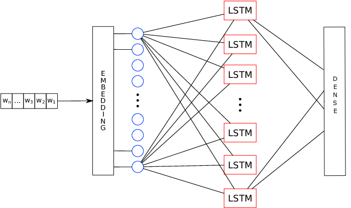
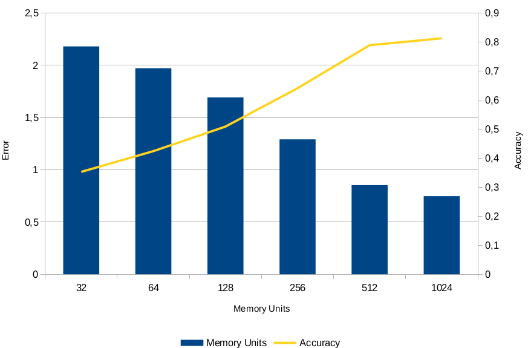
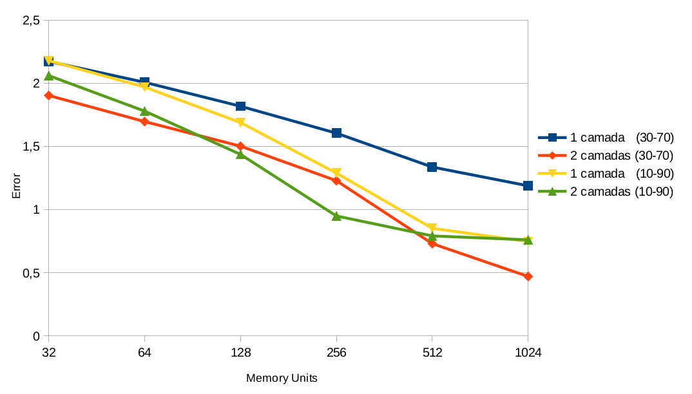
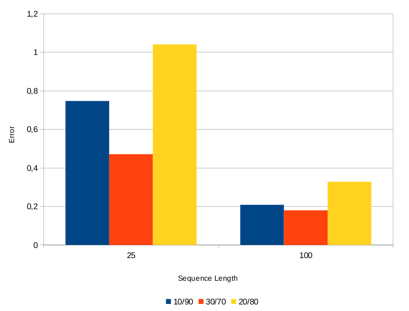
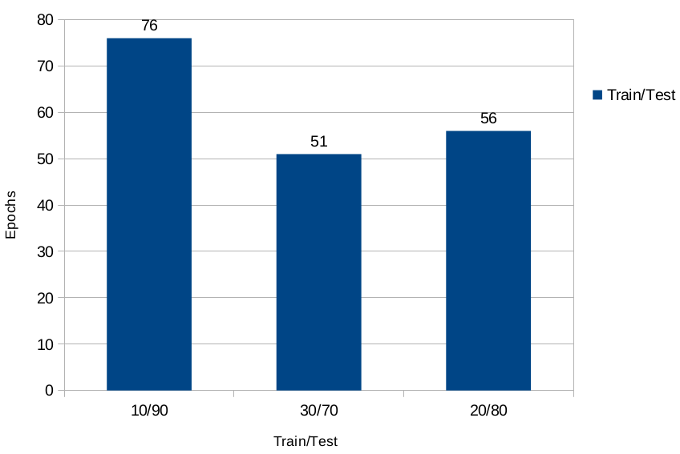
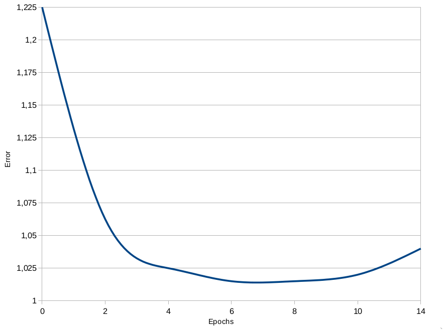

## Recurrent Neural Network (LSMT) password cracker


The main objective of this work is the application of recurrent neural networks, through LSTM(Long short-term memory) architecture for password generation and prediction based on password wordlists.


Algorithm inspired by:  [Shakespeare Text Generation (using RNN LSTM)](https://github.com/trekhleb/machine-learning-experiments/blob/master/experiments/text_generation_shakespeare_rnn/text_generation_shakespeare_rnn.ipynb)


### Used wordlists

**For training and testing**

* [Top204Thousand-WPA-probable-v2](https://github.com/berzerk0/Probable-Wordlists/blob/master/Real-Passwords/WPA-Length/Top204Thousand-WPA-probable-v2.txt)

* [Top2Billion-probable-v2 ](https://github.com/berzerk0/Probable-Wordlists/tree/master/Real-Passwords) (Extracted the first 100 million passwords)

**For comparisons**

* [Crackstation-Human-Only](https://crackstation.net/crackstation-wordlist-password-cracking-dictionary.htm) 
* [RockYou](https://crackstation.net/crackstation-wordlist-password-cracking-dictionary.htm)
* [Top85MillionWPA](https://github.com/berzerk0/Probable-Wordlists/tree/master/Real-Passwords/WPA-Length)
* [Crackstation](https://weakpass.com/wordlist/90) 


### Building Models

The Top204Thousand-WPA-probable-v2 was only used for defining the best hyperparameters. The use of this base is due to being smaller, taking less training time. Of that In this way, the trained models were generated on the following training and test variations: 10/90, 90/10, 20/80, 80/20, 30/70, 70/30. In the sequence, the best hyperparameters found are trained with the wordlist Top2Billion-probable-v2.

### Model and Best Hiperparameters

```
Embedding layer
	embedded dimension: 256
```


**Representation of the neural network model**. **Adapted from** [(BOSCO; PILATO; SCHICCHI, 2018)](https://www.sciencedirect.com/science/article/pii/S1877050918323962)




### Hiperparameters


```
Memory units: 1024
Cells/Hidden Layers:2
Batch Size: 32
Optimizer: Adam
Sequence length: 100
Epochs: 9
```


**Errors obtained for each memory unit with 10/90 Training/Test**. 




**Errors as a function of memory units obtained for 1 and 2 layers of the together 10/90 and 30/70 for base Top204Thousand-WPA-probable-v2.**




**Comparison of errors obtained for sequence sizes of 25 and 100 for bases segmented into 10/90, 30/70 and 20/80**





**Epochs obtained for the 3 segments that obtained the smallest errors**




​						****


After obtaining the best hyperparameters and configurations, two profiles of values were obtained. Due to hardware limitation, the first profile of values was used for base Top2Billion-probable-v2(Extracted the first 100 million passwords).

| Training/Test | Cells | Memory Units | Sequence Length |
| ------------- | ----- | ------------ | --------------- |
| 10/90         | 2     | 1024         | 100             |
| 30/70         | 2     | 1024         | 100             |


Database: [Top2Billion-probable-v2](https://github.com/berzerk0/Probable-Wordlists/tree/master/Real-Passwords)

- 10 millions for training (10%) 
- 90 millions for test (90%)


## Results


**Epochs and Errors obtained for Top2Billion-probable-v2.**




After 9 epochs, the following results were obtained

```
Erro: 0,98
Accuracy: 68%
```


### Evaluating the results

To validate the quality of the model and consequently of the generated passwords, it was used
The Hit Rate (HR) metric was used to measure the password hit rate
$$
HR = \frac{ |U^l_{hits}| } { |U_{all}| }   \label{eq:hit-ratio} \tag{1}
$$

To obtain the best results and verify the best hit rate, it was built a script to perform all possible combinations between the time hyperparameters temperature and number of characters generated when creating passwords by the model neural network. In all, 3 generations were carried out with 5 and 15 seeds.The best result was obtained for 15 seeds. In the sequence, passwords were generated based on the 15 seeds randomly obtained from the test base extracted from Top2Billion-probable-v2.


* All dictionaries: Joining all dictionaries generated for each combination
* Best dictionaries: Merge of the dictionaries that had the best hit rates generated for each combination


**Hit Rate (HR) joining 2nd generation password dictionaries to the base test extracted from Top2Billion-probable-v2.**

|                   | Generated quantity | Number of hits | Hit Ratio |
| ----------------- | ------------------ | -------------- | --------- |
| All dictionaries  | 29257              | 6578           | 22%       |
| Best dictionaries | 1943               | 1079           | 55%       |


### Comparing with other dictionaries


**Hit Rate (HR) merging all 2nd generation dictionaries to 4 different password dictionaries**

| Dictionaries            | Hits  | Hit Ratio |
| ----------------------- | ----- | --------- |
| Crackstation-Human-Only | 4489  | 15%       |
| RockYou                 | 3382  | 11%       |
| Top85MillionWPA         | 1888  | 6%        |
| Crackstation            | 14046 | 48%       |

 


**Hit Rate (HR) joining the best 2nd generation dictionaries to 4 different password dictionaries**

| Dictionaries            | Hits | Hit Ratio |
| ----------------------- | ---- | --------- |
| Crackstation-Human-Only | 656  | 33%       |
| RockYou                 | 536  | 27%       |
| Top85MillionWPA         | 19   | 1%        |
| Crackstation            | 1940 | 99%       |


